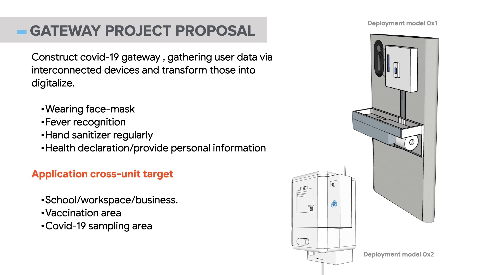
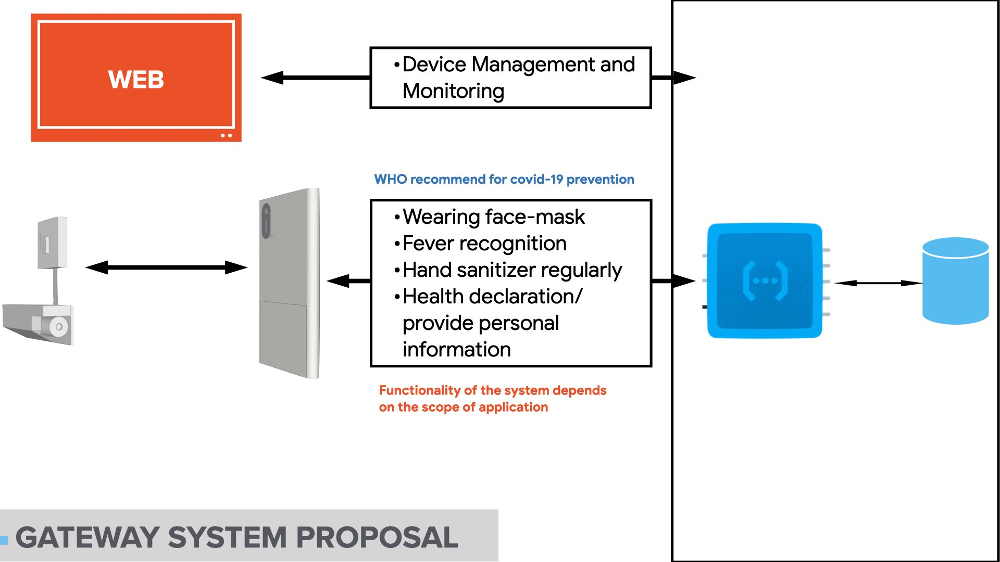
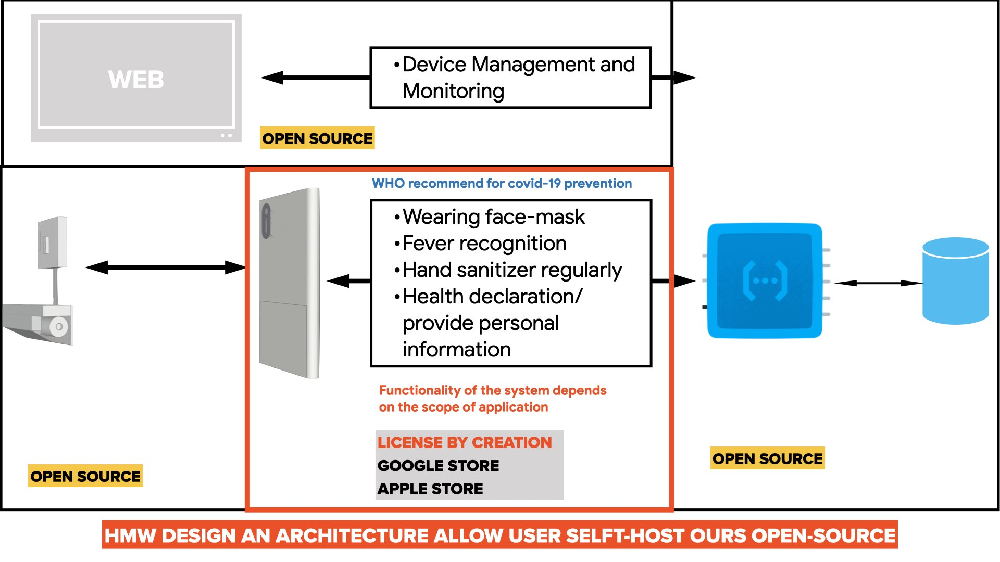
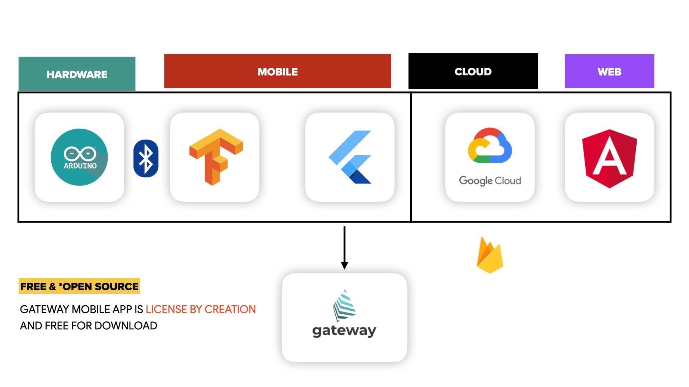

# Gateway
      

> Coronavirus can cause more severe symptoms in people with weakened immune systems, older people and those with long-term conditions like diabetes, cancer and chronic lung disease.

Gateway is an open-source solution for covid 19 situation. Ours goal is provide solution for those `4 major pillar` recommended by WHO.

*`WHO #include 4 major pillar`*

- **`0x1`**. Health Declaration (vaccinated) before enter, via QR code identification.

- **`0x2`**. Wearing facemask protect yourself and others.

- **`0x3`**. Hand sanitizer regularly.

- **`0x4`**. Fever temperature recognition.

#### ```SOLUTION IN ACTION```
We submit our solution in GDSC Solution challenge 2022 base on 17 Sustainable Development Goals of the United Nations more info could be found [here](https://developers.google.com/community/gdsc-solution-challenge) 

Youtube : https://www.youtube.com/watch?v=Kp13HX58oo4

<a href="http://www.youtube.com/watch?feature=player_embedded&v=Kp13HX58oo4" target="_blank"></a>

`An quick introduce of ours scope - TLDR`**`picture`**`is worth a thousand words ⬇️`

---


---



---

We've been in those situation and manual "Guidance & Prevenence" of coronavirus  and "Back to office" or coming back to normal. Manual we mean by we still have security

<p align=center style="background-color:whitesmoke; padding:10px">  

Within ours scope we define an "cost effected" "self-hostable" solution, ours goal is widespread this solution - with that in mind. We're aim to support this solution Documentation, [Wiki](https://github.com/GDSC-HSU/gateway/wiki/TEAM-DEVELOPMENT-SETUP) and configuration by doing so we could encourage learner in high school, collages students build up this solution by their own.

further detail are covered in this issue ref [link](https://github.com/GDSC-HSU/gateway/issues/11)

---


---

Gateway in an application running in yours device  (ours supported architecture). It will communicate with gateway-devices with it wireless sensor over Bluetooth connection protocol. By combining application and IoT devices, we’re able enable an solution for covid-19 control and prevention.

---


---

We also `encourage undergraduate, learner, students` who might found interesting about “technical” aspect of the project, they could find by themselves having a `“proof of concept”` of how those technology work together in an ecosystem and better or `excel their STEM innovation`.


##### Supported architecture :
- Gateway : Mobile (Android, IOS), Web (coming soon), Google Cloud Platform.
- Gateway-devices: ESP32 BLE, Arduino framework.
- Google Cloud Platform : Infrastructure as code provisioning (backend, firebase) via [`terraform`](./gateway-core/tf/)


---
##### Project structure module

Project compose 4 git submodule

1. Mobile Application  [current directory](./)
2. IoT Embedded device [./ble_devices/](https://github.com/GDSC-HSU/gateway-devices)
3. Backend Infrastructure [./gateway-core](https://github.com/GDSC-HSU/gateway-core)
4. Web Configuration – Management Dashboard [./gateway-dashboard](https://github.com/GDSC-HSU/gateway-dashboard)


README.MD : are covered in each module for clearer explanation + installation + self-host solution


---

#### How to run this project
**Bellow steps are required** to run fully gateway application which include Flutter - IOT - Web dashboard.

- Clone project to local machine:

  ```git clone https://github.com/GDSC-HSU/gateway```

- Open your terminal and run:

  ```flutter pub get```

- Connect real device (this app using camera and bluetooth so you should connect to real device)
  
  Follow this for connect your real device [Android](https://developer.android.com/studio/run/device) or [IOS](https://developer.apple.com/documentation/xcode/running-your-app-in-the-simulator-or-on-a-device)

  We tested on: Iphone 6s (IOS 15.2) and Niko C20 (Android 10)

- Finally run command and enjoy 🎉✨🎉✨:

  ```flutter run```

- `Web dashboard` you need to sign-up and create organization for device configuration our public domain https://gdsc-gateway.web.app/ that will be required in Flutter for QRScan
- `IoT device` you need an device for the application, detail how the device installation will be found [here](https://github.com/GDSC-HSU/gateway-devices#installation) device also required sensor if don't have those part please refer to our docs [how to mock BLE data over serial](https://github.com/GDSC-HSU/gateway-devices#dont-have-board-sensor-problem-solved)
- More document run project with [Flutter](https://docs.flutter.dev/)

#### Gateway(main) UI tour
<div style="display:flex;flex-direction:row">
  
  <div style="margin-left:15px">
    <h6 style="margin:0px">Minimal ui-flow</h6>
    <div>1. Mobile required permission (BLE, camera)</div>
    <div>2. IoT Device Scanning</div>
    <div>3. Config Mobile device link to an organization via QR configure code</div>
    <div>4. Main page (gateway check) <a href="https://github.com/GDSC-HSU/gateway/issues/51">detail here</a></div>
  </div>
</div>

https://user-images.githubusercontent.com/42218324/161300916-a2926435-dd75-46ed-95bf-829e779f6ab0.mp4

#### Contributor:

<a href="https://github.com/GDSC-HSU/gateway/graphs/contributors">
  
</a>

Made with [contrib.rocks](https://contrib.rocks).