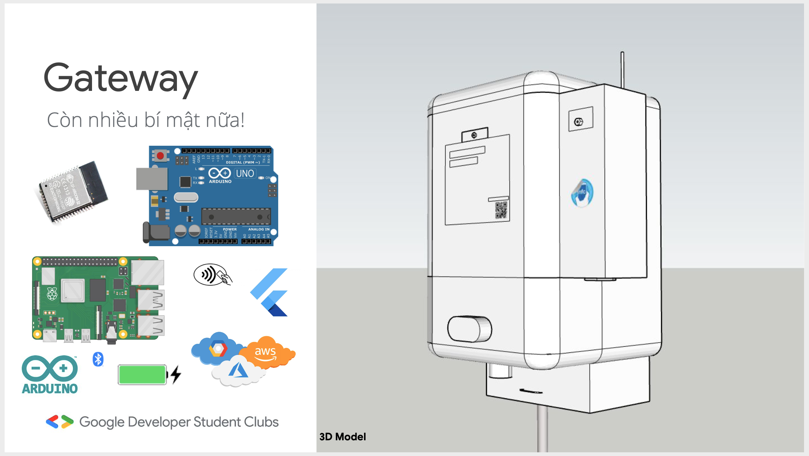
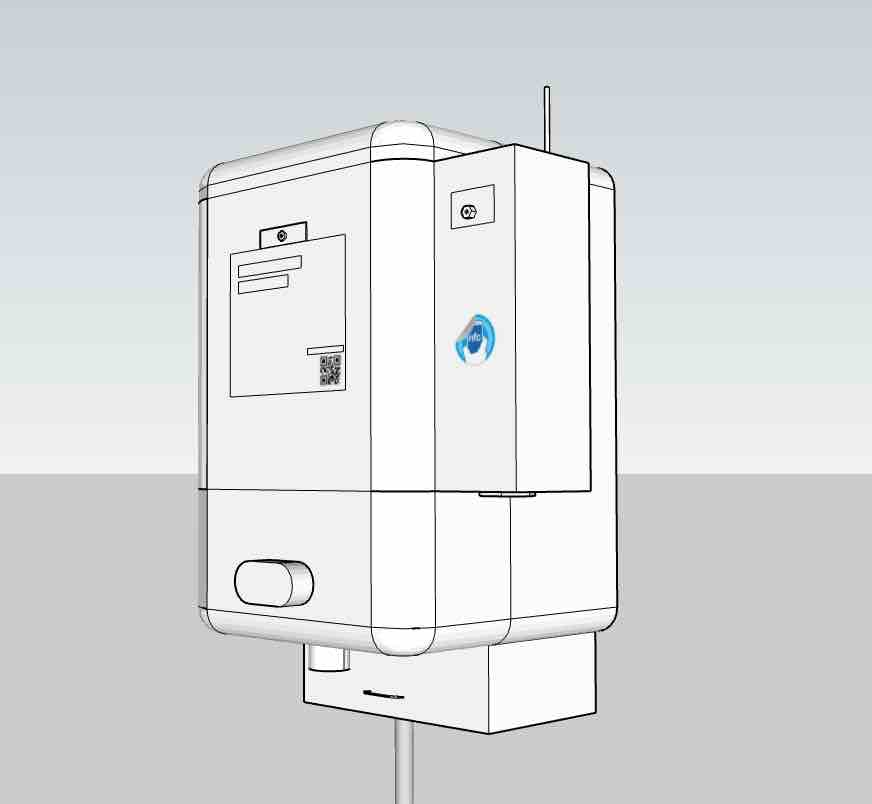
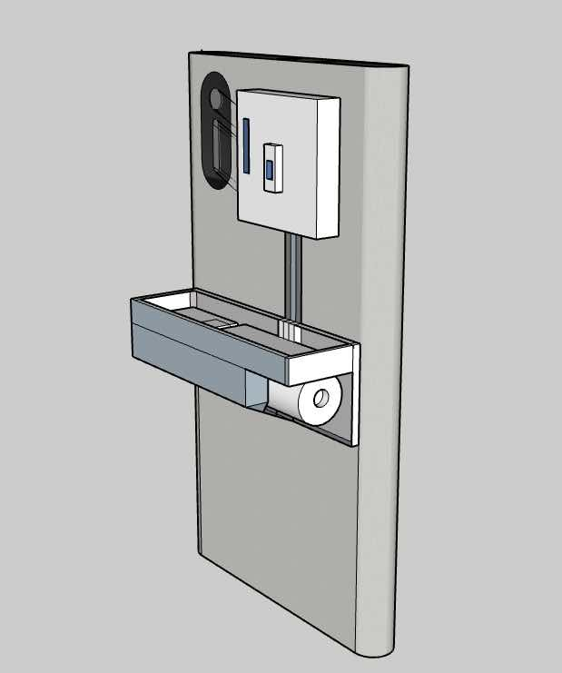

# Gateway

> The Importance of IoT to During the COVID-19 Outbreak

A new way we could think about an DIY IoT project in ours daily development this project **#include** Flutter, Bluetooth Low Energy, ESP32, Arduino, Raspberry pi(Linux SBCs). No spoiler alert yet!
<div>
<a href="http://www.youtube.com/watch?feature=player_embedded&v=RvnyX0l7zPM" target="_blank"></a>
</div>

&nbsp;
<a href="https://www.youtube.com/watch?v=RvnyX0l7zPM"></a>
Boxes model|Adapted model
|---|---|
| 
&nbsp;
*WIP spoiler alert* 🤟:If your guys are Vietnamese just come and watch ours [idea illustration](https://www.youtube.com/watch?v=RvnyX0l7zPM) **English subtitle* will coming soon if your folks interested just open an issue[en-sub], we gonna do it. *We're not saying it yet*, we're open the project to everyone who care about the problem.

### Getting to know

This project is a not starting point for a  an usual Flutter application. **Just kidding 😭*
#### ```README.MD PER FOLDER ABSTRACT IMPL```
##### ```~solution/approach architecture~ ⬇️```
1. [BLOC README](./lib/blocs/) wip
2. [CONFIG](./lib/config) wip
3. PAGE

~~ work-in-progress 🤕

#### Further along my attempted maniac project
Don't looking for any beauty in architecture design principle, **attempted project* is something it could prove something that is possible or an (POC).

1. [Valerian](https://github.com/truonghoangduy/Valerian) Flutter with ESP32-CAM with maniac feature [***Tensorflow, SMS Reader*** -> In foreground mode] wrap with [Bluetooth SPP Mode] not work with Apple®MFI.
2. [WebRTC Full Mesh](https://github.com/truonghoangduy/Stream-It) Maniac way to DIY video conferencing with WebRTC protocol to full mesh calling with [***Angular***, Nodejs-Firebase, WebRTC].

##### Tested-Main(development) device
1. Iphone 6s (BLE 4.2)
3. Ipad Pro  (BLE 5.0)
4. Android -BLE SUPPORT HDMI (Samsung Dex like) - un-tested
5. ESP32 - (BLE 4.2)

